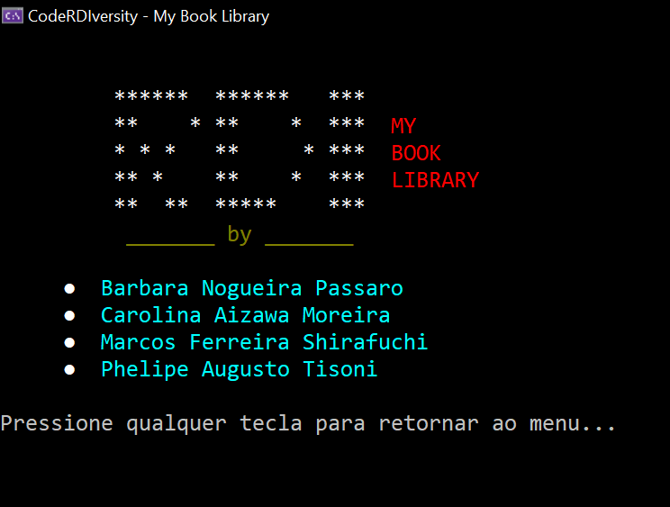
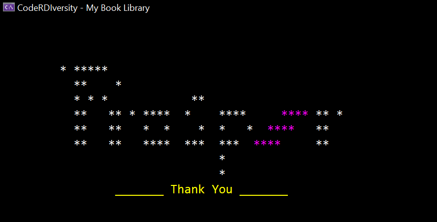

https://user-images.githubusercontent.com/21223609/232902814-86bd2681-b621-476f-b47a-c5b8ce995b67.mp4

# CodeRDIversity - My Book Library

   

Projeto console de sistema de empréstimo de livros de uma biblioteca.

## Sobre o Projeto
Desenvolvido em Março de 2023 durante o **CodeRDIversity** organizado pela **Prosper Tech Talents** em parceria com a **RDI Softwares** para o **treinamento** de **PCD's** na **linguagem C#**, o **My Book Library** tem como objetivo a exibição de um menu que executa funções de cadastro, empréstimo e devolução de livros. O projeto foi proposto como atividade prática do curso, sendo orientado por **Rodrigo Grigoleto**.

## Tecnologias Utilizadas
- [Linguagem C#](https://learn.microsoft.com/en-us/dotnet/csharp/tour-of-csharp/)
- [.Net 6.0](https://dotnet.microsoft.com/en-us/download/dotnet/6.0)
- [Visual Stuio 2022 Community](https://visualstudio.microsoft.com/pt-br/vs/)
- [Google Drive](https://www.google.com/drive/)

# Como Clonar o Projeto

- Instale o [Git](https://git-scm.com/downloads) no seu computador. Durante a instalação, certifique-se se a opção **Git Bash** está adicionada.
- Após a instalação, crie uma pasta em sua área de trabalho
- Dentro da pasta, clique com o botão direito e selecione **Git Bash Here**
- Após abrir o terminal, copie o seguinte comando:
   
```bash
git clone https://github.com/PhilTisoni/CodeRDIversity.MyBookLibrary.git
```
Após clonar o projeto, adicione o código em seu Arduino conectado aos componentes eletrônicos.

# Índice

- <a href = "#Elementos-Visuais">Elementos Visuais</a>
- <a href = "#Menu">Menu</a>
- <a href = "#Funcionalidades">Funcionalidades</a>
- <a href = "#Regras-de-Negócio">Regras de Negócio</a>
- <a href = "#Próximos-Passos">Próximos Passos</a>
- <a href = "#Autores">Autores</a>
- <a href = "#Agradecimentos">Agradecimentos</a>

# Elementos Visuais

Pensando na experiência do usuário, a equipe desenvolveu uma **tela de abertura** contendo o nome dos desenvolvedores, nome do projeto e a logo da **RDI Software**, também foi alterado o título da janela a as cores do console, criando uma introdução ao programa.



Ao selecionar a opção **Sair** do menu, o usuário é direcionado para a tela de encerramento, mostrando uma arte da logo da **Prosper Tech Talents** e um agradecimento.



Para os elementos visuais, foi criada uma classe com métodos de formatação de fontes (CorFonte) e as strings foram concatenadas para facilitar a leitura do código.
```c#
   internal static class ArteTela
    {        
        public static void ExibirAbertura()
        {
            Console.Title = "CodeRDIversity - My Book Library";

            CorFonte.MultiplasCores
                ("branco", "\n\n         ******  ******   ***           " +
                             "\n         **    * **    *  ***  ", "vermelho", "MY",
                 "branco",   "\n         * * *   **     * ***  ", "vermelho", "BOOK",
                 "branco",   "\n         ** *    **    *  ***  ", "vermelho", "LIBRARY",
                 "branco",   "\n         **  **  *****    ***          ",
                 "dourado", "\n          _______ by _______\n\n");

            Thread.Sleep(2000);

            CorFonte.MultiplasCores
                ("branco", "     ● ", "ciano", " Barbara Nogueira Passaro\n",
                 "branco", "     ● ", "ciano", " Carolina Aizawa Moreira\n",
                 "branco", "     ● ", "ciano", " Marcos Ferreira Shirafuchi\n",
                 "branco", "     ● ", "ciano", " Phelipe Augusto Tisoni\n");

            Menu.RetornarMenu();
        }  
    }
```


# Menu

O Menu principal foi inspirado no [tutorial](https://www.youtube.com/watch?v=YyD1MRJY0qI "Tutorial Menu") de [Ricardo Gerbaudo](https://github.com/ricardogerbaudo "Ricardo Garbaudo"), tendo funções e adaptações para o projeto apresentado. Ele conta com as opções:

- <a href="#Cadastrar-Pessoa">Cadastrar Pessoa</a>
- <a href="#Cadastrar-Livro">Cadastrar Livro</a>
- <a href="#Emprestar-Livro">Emprestar Livro</a>
- <a href="#Devolver-Livro">Devolver Livro</a>
- <a href="#Listar-Livros-Cadastrados">Listar Livros Cadastrados</a>
- <a href="#Listar-Pessoas-Cadastradas">Listar Pessoas Cadastradas</a>
- <a href="#Listar-Livros-Emprestados">Listar Livros Emprestados</a>
- <a href="#Sair">Sair</a>

A partir de um **switch**, apenas as teclas para **baixo**, para **cima** e **Enter** ficam habilitadas, evitando **exceptions** ou falhas caso o usuário digite outra tecla. O menu conta com a interação de retornar para a última opção (Sair) caso a tecla para cima seja pressionada enquanto estiver na primeira opção (Cadastrar Pessoa), o mesmo se aplica na situação contrária. O código abaixo demonstra essas funcionalidades:

```c#
  switch (tecla.Key)
                {
                    case ConsoleKey.DownArrow:
                        selecao = (selecao == opcoes.Length - 1 ? 0 : selecao + 1);
                        break;
                    case ConsoleKey.UpArrow:
                        selecao = (selecao == 0 ? opcoes.Length - 1 : selecao - 1);
                        break;
                    case ConsoleKey.Enter:
                        Console.Clear();
                        opcaoSelecionada = true;
                        break;
                }
```

 O menu também conta com o efeito visual de **mudança de cor** quando as teclas de navegação para baixo ou para cima são pressionadas, reforçando a escolha do usuário através de um emoji ao lado esquerdo. Após escolher uma das funções e retornar ao menu principal, o item continua na última posição selecionada, facilitando para o usuário a localização dos itens do menu principal. Você pode visualizar uma demonstração do projeto clicando [aqui.](https://user-images.githubusercontent.com/21223609/232903080-2aee4a6c-004b-4abe-9599-3f047868f77a.mp4)


# Funcionalidades

## Cadastrar Pessoa
Realiza validações para que todos os campos sejam preenchidos e não permite um ID menor que zero ou utilizando letras. Caso o cadastro possua um ID já cadastrado, uma mensagem é exibida e a lista de Pessoas não é preenchida. Para o cadastro são necessários:

- Nome
- CPF
- Telefone
- ID Pessoa

## Cadastrar Livro
De modo similar, a opção Cadastrar Livro realiza as mesmas validações, porém, os campos de preenchimento são:

- Título
- Autor
- Editora
- ID Livro

## Emprestar Livro
Essa opção confere se os ID's do livro e da pessoa são válidos e se o livro já foi emprestado. Caso seja fornecido um ID não cadastrado ou o livro tenha sido emprestado anteriormente, uma mensagem é exibida para informar o usuário. Os dados pedidos são:

- ID Pessoa:
- ID Livro

## Devolver Livro
Realiza a tarefa contrário ao Emprestar Livro com as mesmas validações, porém, caso uma pessoa tente devolver um livro que não emprestou, uma mensagem é exibida para o usuário. Os dados pedidos são:

- ID Pessoa:
- ID Livro

## Listar Livros Cadastradas
Exibe todos os livros cadastrados, caso não seja feito nenhum cadastro anteriormente, uma mensagem é exibida para o usuário.

## Listar Pessoas Cadastradas
Exibe todas as pessoas cadastradas, caso não seja feito nenhum cadastro anteriormente, uma mensagem é exibida para o usuário.

## Listar Livros Emprestados
Exibe todas as pessoas e seus respectivos livros emprestados, caso não seja feito nenhum cadastro anteriormente, uma mensagem é exibida para o usuário. Essa lista é atualizada dinâmicamente.

## Sair
Exibe a tela de encerramento e fecha a aplicação.

# Regra de Negócio
Para o desenvolvimento do projeto, foi proposto um roteiro de estudos com os passos iniciais, e posteriormente, foram adicionadas novas implementações. O documento inicial encontra-se na pasta assets.

# Próximos Passos
Planeja-se melhorar a classe de Elementos visuais:
- [ ] Aplicando conceitos SOLID para evitar a repetição de código
- [ ] Melhorar método MultiplasCores()

# Autores
- [Barbara Nogueira Passaro](linkedin.com/in/bárbara-nogueira-passaro-b438a9146 "Barbara Linkedin")
- [Carolina Aizawa Moreira](https://www.linkedin.com/in/carolina-aizawa-moreira-pcd-9b0624179/ "Carolina Linkedin")
- [Marcos Ferreira Shirafuchi](https://www.linkedin.com/in/marcos-shirafuchi-5735495a/ "Marcos Linkedin")
- [Phelipe Augusto Tisoni](https://www.linkedin.com/in/phelipetisoni "Phelipe Linkedin")

# Agradecimentos
- [Rodrigo de Nadai Grigoleto](https://www.linkedin.com/in/rodrigo-de-nadai-grigoleto-58558133/ "Rodrigo Linkedin")
- [Prosper Tech Talents](https://www.linkedin.com/company/prosper-tech-talents/ "Prosper Linkedin")
- [RDI Software](https://www.linkedin.com/company/rdisoftware/ "RDI Linkedin")
